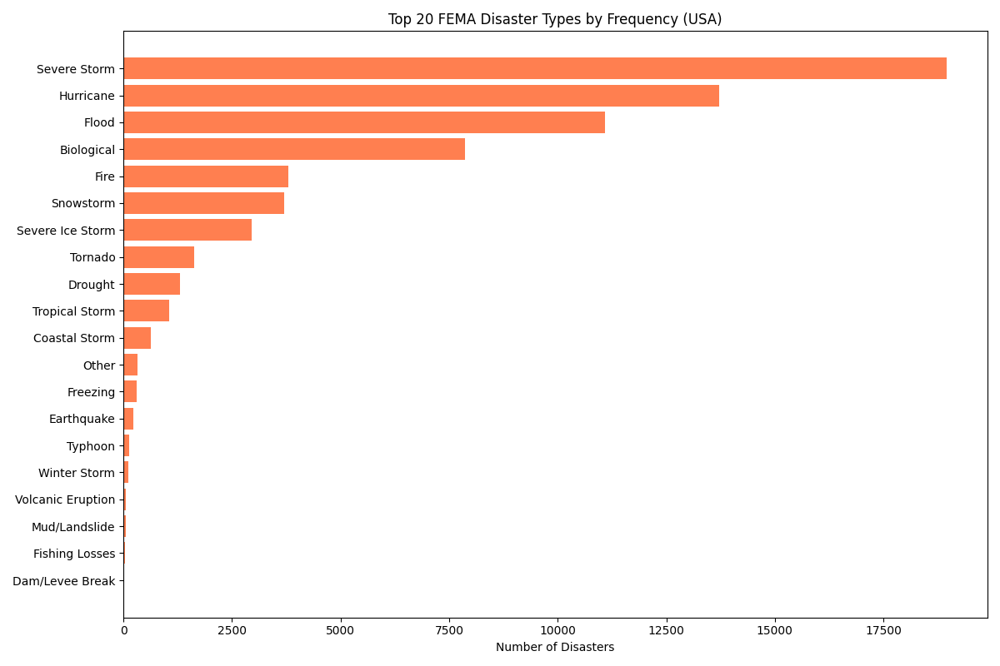
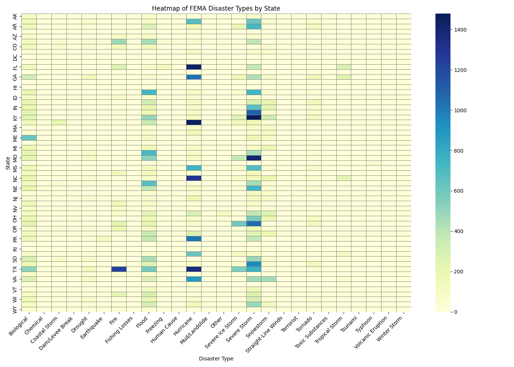
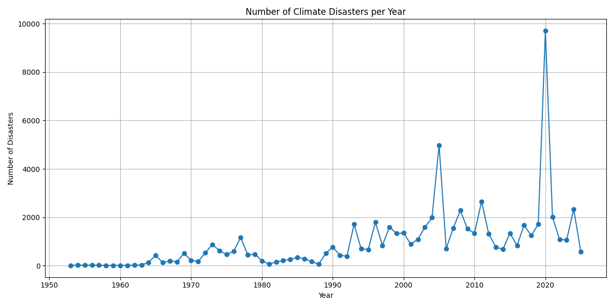

# 🌪 FEMA Climate Disaster Risk Prediction

This project analyzes FEMA disaster declarations alongside drought levels and social vulnerability indices (SVI) to build a machine learning model predicting the likelihood of wildfire events in US states.

## 📊 Data Sources
- **FEMA Disaster Declarations**: Official disaster reports by state and year.
- **CDC Social Vulnerability Index (SVI)**: Measures the resilience of communities.
- **U.S. Drought Monitor**: Historical drought severity by state and year.

## 🔧 Features Used
- `SVI`: Social vulnerability index by state.
- `Year`: Declaration year.
- `AvgDroughtLevel`: Weighted average drought level by state and year.

## 🤖 Model
A `RandomForestClassifier` is trained to classify whether a wildfire occurred (`is_fire = 1`) using climate and socioeconomic indicators.

### Model Performance:
- **Accuracy**: ~85%
- **F1-score (Fire)**: 0.61
- **Precision (Fire)**: 0.67
- **Recall (Fire)**: 0.55

### ✅ Model Summary & Key Insights

The model accurately identifies **85%** of all disaster events overall.  
It shows **strong predictive power for non-wildfire years**, and **increasing performance** in detecting wildfires.

- **Drought level** and **SVI** (Social Vulnerability Index) both contribute significantly to wildfire prediction.
- **Precision for wildfires is 67%**, meaning when the model predicts a wildfire, it is correct two out of three times.
- **Recall is 55%**, indicating that the model successfully detects **over half of all real wildfire events** — a promising foundation for early warning and preparedness systems.

## 🖼️ Sample Visuals

### 📌 Top 20 Disaster Types in the U.S.


### 🗺️ Heatmap: Disaster Frequency by State & Type


### 📈 Trend: Disasters Per Year


### 🔍 Scatter: Disaster Frequency vs Vulnerability Index


## 📁 Files
- `FEMA_Model_With_Scatter.ipynb`: Final notebook with data processing, modeling, and visualizations.
- `SVI_2020_US_county.csv`: Social Vulnerability raw data.
- `dm_export_20000101_20231231.csv`: Drought Monitor historical data.

## 🚀 How to Run
1. Install dependencies:
```bash
pip install pandas matplotlib seaborn scikit-learn


---
## 📃 License

This project is licensed under the MIT License.

---

## 🤝 Contributions

Pull requests and forks are welcome!  
Let’s build smarter, more resilient communities together 🌎


